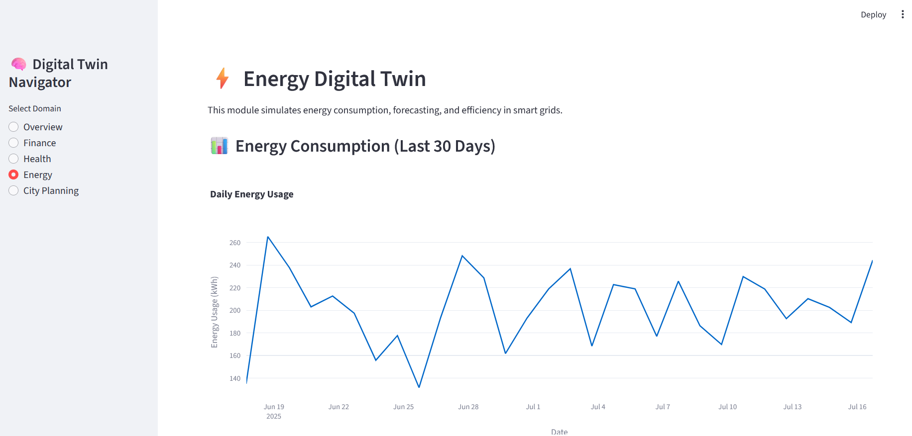

<div align="center">



# 🧠 Digital Twin ML Platform

A modular **Machine Learning-based Digital Twin** dashboard built with [**Streamlit**](https://streamlit.io), designed to empower cross-domain teams such as **Finance**, **Health**, **Energy**, and **Urban Planning** through scientific visualization and interactivity.

</div>

---

## 🚀 Features

- ✅ **Modular architecture** for seamless collaboration between teams  
- 📊 **PCA-based** dimensionality reduction and visual analytics  
- 🧩 **Interactive dashboards** using **Streamlit** and **Plotly**  
- 🔌 Easily extendable to new verticals and use cases  
- 💡 Supports simulation and monitoring in:
  - 💵 **Finance** (KPIs, PCA)
  - 🩺 **Health** (Vital signs simulation)
  - ⚡ **Energy** (Smart grid & load forecasting)
  - 🏙️ **Urban Planning** (Traffic & pollution models)

---

## 📁 Project Structure

```
digital-twin-ml-platform/
├── app.py                # Main dashboard entry point
├── utils/
│   └── overview.py       # Intro/landing page
├── modules/              # Domain-specific modules
│   ├── finance.py
│   ├── health.py
│   ├── energy.py
│   └── city.py
├── data/
│   └── finance.csv       # Sample dataset
├── assets/
│   └── logo.png          # Project logo
├── requirements.txt      # Python dependencies
```

---

## ⚙️ Installation & Run

1. **Install the dependencies**:
   ```bash
   pip install -r requirements.txt
   ```

2. **Run the dashboard**:
   ```bash
   streamlit run app.py
   ```

---

## 📦 Dependencies

The main Python packages used:

- `streamlit`
- `pandas`
- `numpy`
- `scikit-learn`
- `plotly`

> 💡 You can generate `requirements.txt` by running:
> ```bash
> pip freeze > requirements.txt
> ```

---

## 🤝 Contributing

Each team (e.g., finance, health) can develop their module inside the `modules/` directory.

Pull requests are welcome! Please follow standard [GitHub contribution guidelines](https://opensource.guide/how-to-contribute/).

---

## 📝 License

*(You can optionally add your project’s license here, e.g., MIT, Apache 2.0, etc.)*
